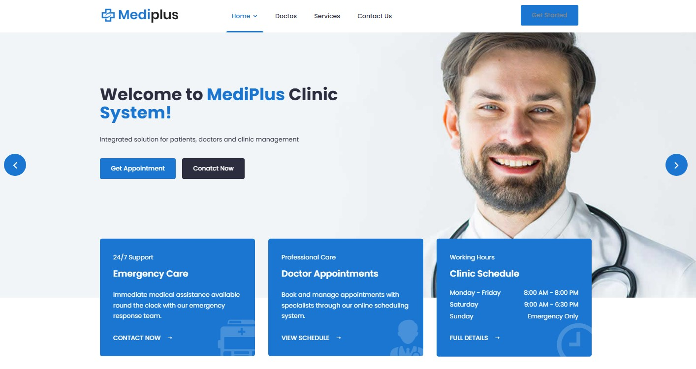
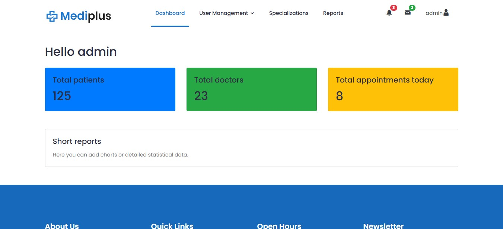
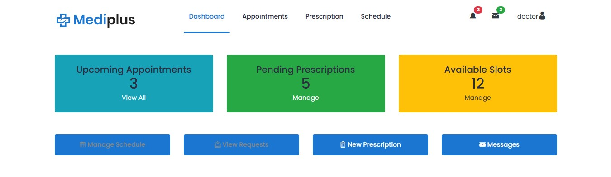
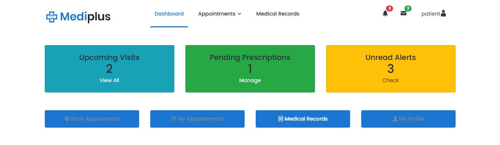
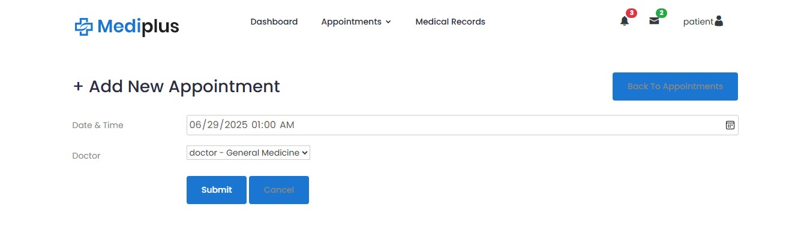
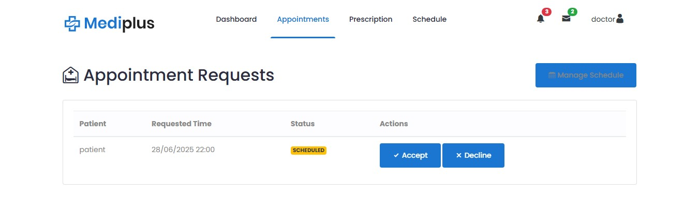
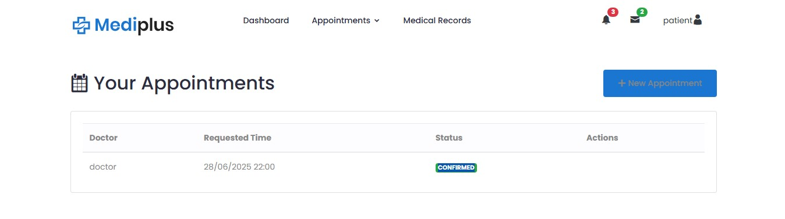
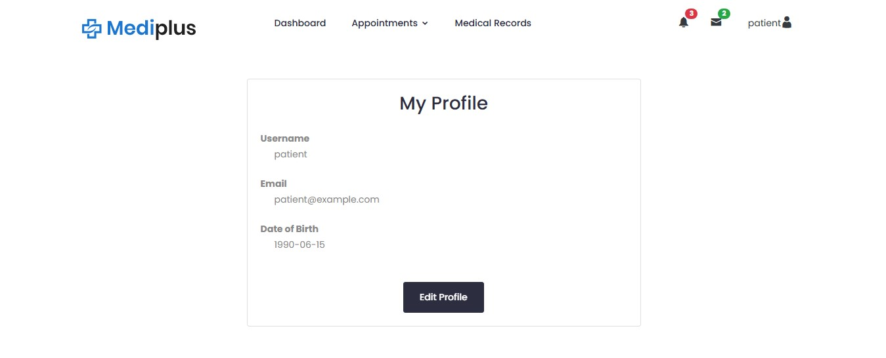

# 🏥 **MediPlus Clinic Management System**
> _A full-stack clinic management system built with Spring Boot (Java) for the backend and a static front-end using HTML, CSS, JavaScript, and jQuery. The application provides functionalities for three primary user roles: Patients, Doctors, and Administrators._

## 📖 Overview
> _MediPlus is designed to streamline clinic operations by providing a comprehensive platform for managing patient appointments, medical records, and administrative tasks. It offers distinct functionalities tailored to the roles of patients, doctors, and administrators, ensuring a secure and efficient healthcare management experience._

---

## ✨ Features
- **Patient Module**
  - Self-registration, login, and profile management.
  - Booking, viewing, editing, and canceling appointments with doctors.
  - Viewing medical records and prescriptions.
  - Receiving notifications when a doctor confirms or rejects an appointment.
- **Doctor Module**
  - Login and profile management.
  - Viewing a list of patient appointments.
  - Confirming or rejecting appointment requests.
  - Managing personal schedule.
  - Receiving notifications when a patient requests or modifies an appointment.
- **Administrator Module**
  - Managing all user accounts (doctors, patients, pharmacists, receptionists).
  - Configuring medical departments and specializations.
  - Generating statistical reports (e.g., number of patients, appointments, revenue).
  - Viewing system logs and monitoring unauthorized access attempts.

<div align="center">
  <a href="#-table-of-contents" style="text-decoration: none; border: 1px solid #ddd; border-radius: 5px; padding: 8px 16px; transition: background-color 0.3s;">
    🔝 Back to Top
  </a>
</div>

---

## 🚀 Getting Started
To get started with the MediPlus Clinic Management System, you will need to set up both the backend and frontend components. Please refer to the respective README files for detailed instructions:

- [**Backend Setup**](Mediplus-Backend/README.md)
- [**Frontend Setup**]()


## 📁 Project Structure
 ```
 Mediplus-Spring-FullStack/
├── Mediplus-Backend/               # Spring Boot backend (Java)
├── Mediplus-Frontend/              # Static HTML/CSS/JavaScript frontend
└── Screenshots/                    # Project screenshots
 ```

For a more detailed breakdown of the backend and frontend structures, please refer to their dedicated README files.


## 📸 Screenshots

### Home Page


### Admin Dashboard


### Doctor Dashboard


### Patient Dashboard


### Add Appointment


### Doctor Appointment View


### Patient Appointment View


### User Profile



